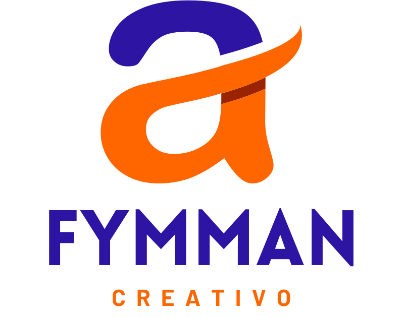
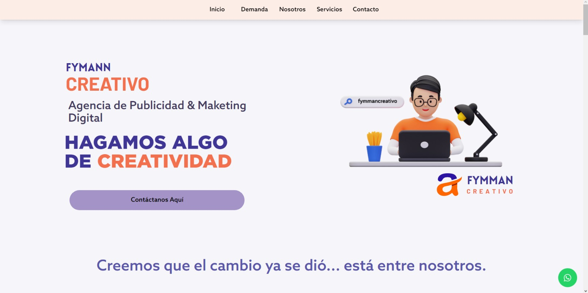

# Fymman Creativo - Sitio Web Responsive

¡Bienvenido al repositorio de Fymman Creativo, la Agencia de Publicidad & Marketing Digital! Este proyecto es una página web responsive construida con ReactJs, HTML, CSS, JS, Vite y Tailwind CSS.

## Capturas de Pantalla

## Características Principales

- **Diseño Responsive:** La página web está diseñada para adaptarse a diferentes tamaños de pantalla, desde dispositivos móviles hasta desktops.
- **Tecnologías Utilizadas:**
  - ReactJs
  - HTML
  - CSS
  - JS
  - Vite
  - Tailwind CSS

## Instalación

1. Clona este repositorio: `git clone https://github.com/tu-usuario/fymman-creativo.git`
2. Instala las dependencias: `npm install`
3. Inicia el servidor de desarrollo: `npm run dev`
4. Abre tu navegador y visita [http://localhost:3000](http://localhost:3000)

## Contribuciones

¡Contribuciones son bienvenidas! Si encuentras algún error o tienes ideas para mejoras, por favor, abre un issue o envía una pull request.

## Licencia

Este proyecto está bajo la Licencia MIT

---
Esperamos que disfrutes explorando el repositorio y que encuentres útil la implementación de Fymman Creativo. ¡Gracias por tu interés y apoyo!
